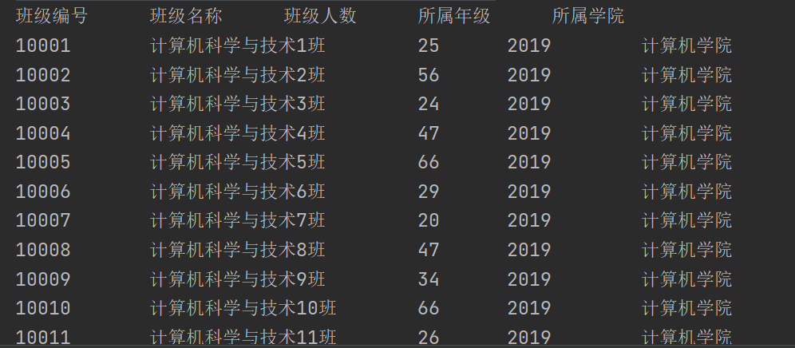
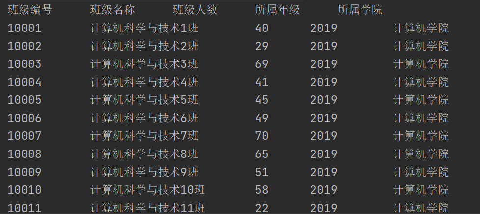
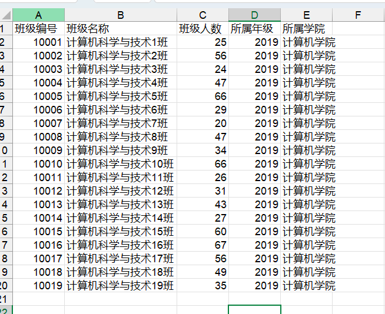
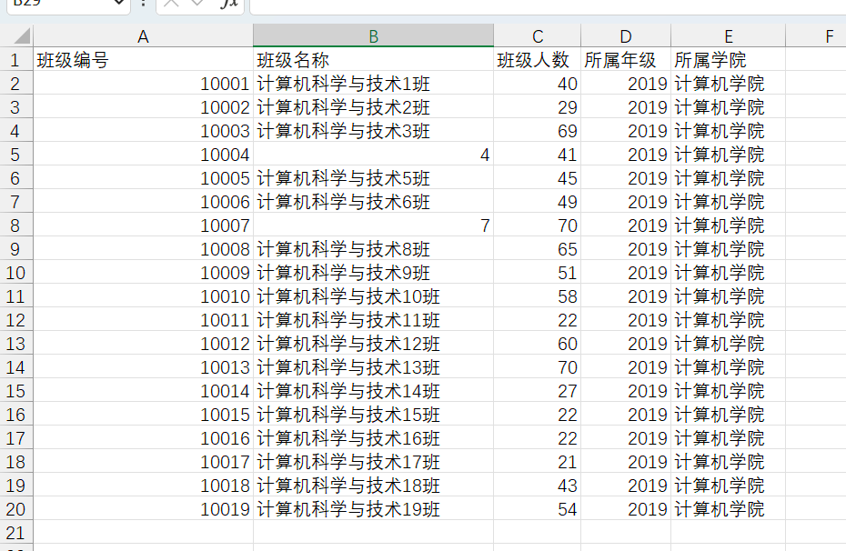
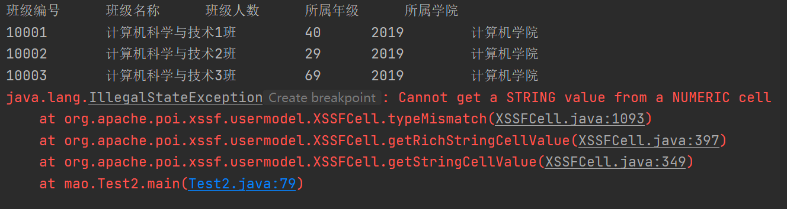
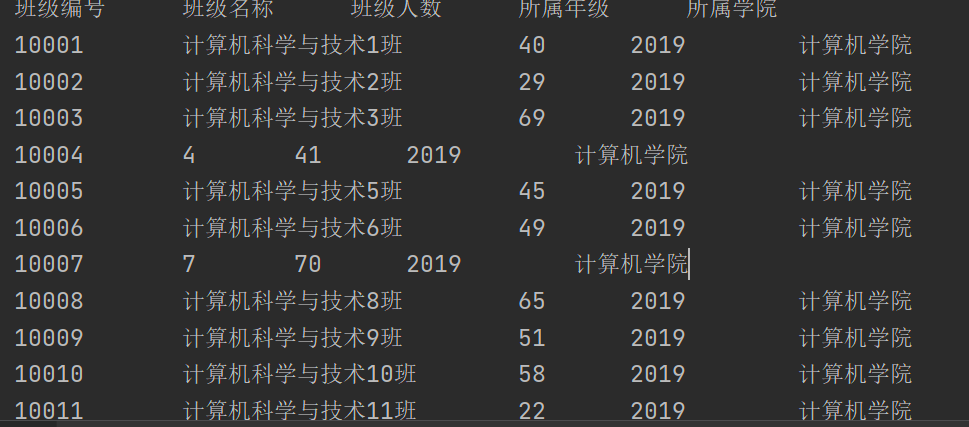

### 导入excel

导入上述生成的低版本的xls文件：

```java
package mao;

import org.apache.poi.hssf.usermodel.HSSFWorkbook;
import org.apache.poi.ss.usermodel.Row;
import org.apache.poi.ss.usermodel.Sheet;
import org.apache.poi.ss.usermodel.Workbook;

import java.io.FileInputStream;

/**
 * Project name(项目名称)：java报表_POI导入excel
 * Package(包名): mao
 * Class(类名): Test1
 * Author(作者）: mao
 * Author QQ：1296193245
 * GitHub：https://github.com/maomao124/
 * Date(创建日期)： 2023/6/1
 * Time(创建时间)： 21:30
 * Version(版本): 1.0
 * Description(描述)： poi 导入excel 低版本
 */

public class Test1
{
    public static void main(String[] args)
    {
        try (final FileInputStream fileInputStream = new FileInputStream("./class.xls"))
        {
            //加载工作簿
            Workbook workbook = new HSSFWorkbook(fileInputStream);
            //读取第一个工作表
            Sheet sheet = workbook.getSheetAt(0);
            //得到最后一行
            int lastRowNum = sheet.getLastRowNum();
            //得到第0行
            Row row = sheet.getRow(0);
            //校验表头
            String stringCellValue = row.getCell(0).getStringCellValue();
            if (!"班级编号".equals(stringCellValue))
            {
                throw new UnsupportedOperationException("表格格式不支持");
            }

            stringCellValue = row.getCell(1).getStringCellValue();
            if (!"班级名称".equals(stringCellValue))
            {
                throw new UnsupportedOperationException("表格格式不支持");
            }

            stringCellValue = row.getCell(2).getStringCellValue();
            if (!"班级人数".equals(stringCellValue))
            {
                throw new UnsupportedOperationException("表格格式不支持");
            }

            stringCellValue = row.getCell(3).getStringCellValue();
            if (!"所属年级".equals(stringCellValue))
            {
                throw new UnsupportedOperationException("表格格式不支持");
            }

            stringCellValue = row.getCell(4).getStringCellValue();
            if (!"所属学院".equals(stringCellValue))
            {
                throw new UnsupportedOperationException("表格格式不支持");
            }

            System.out.println("班级编号\t\t班级名称\t\t班级人数\t\t所属年级\t\t所属学院");

            //遍历读取数据
            for (int i = 1; i <= lastRowNum; i++)
            {
                //读取第i行
                row = sheet.getRow(i);
                //读取班级编号
                int classNo = ((Double) row.getCell(0).getNumericCellValue()).intValue();
                //读取班级名称
                String className = row.getCell(1).getStringCellValue();
                //读取班级人数
                int classCount = ((Double) row.getCell(2).getNumericCellValue()).intValue();
                //读取所属年级
                int grade = ((Double) row.getCell(3).getNumericCellValue()).intValue();;
                //读取所属学院
                String academy = row.getCell(4).getStringCellValue();
                System.out.println(classNo + "\t\t" + className + "\t\t" + classCount + "\t\t" + grade + "\t\t" + academy);
            }
        }
        catch (Exception e)
        {
            e.printStackTrace();
        }

    }
}
```





导入上述生成的高版本的xlsx文件：

```java
package mao;

import org.apache.poi.hssf.usermodel.HSSFWorkbook;
import org.apache.poi.ss.usermodel.Row;
import org.apache.poi.ss.usermodel.Sheet;
import org.apache.poi.ss.usermodel.Workbook;
import org.apache.poi.xssf.usermodel.XSSFWorkbook;

import java.io.FileInputStream;

/**
 * Project name(项目名称)：java报表_POI导入excel
 * Package(包名): mao
 * Class(类名): Test2
 * Author(作者）: mao
 * Author QQ：1296193245
 * GitHub：https://github.com/maomao124/
 * Date(创建日期)： 2023/6/1
 * Time(创建时间)： 21:54
 * Version(版本): 1.0
 * Description(描述)： 无
 */

public class Test2
{
    public static void main(String[] args)
    {
        try (final FileInputStream fileInputStream = new FileInputStream("./class.xlsx"))
        {
            //加载工作簿
            Workbook workbook = new XSSFWorkbook(fileInputStream);
            //读取第一个工作表
            Sheet sheet = workbook.getSheetAt(0);
            //得到最后一行
            int lastRowNum = sheet.getLastRowNum();
            //得到第0行
            Row row = sheet.getRow(0);
            //校验表头
            String stringCellValue = row.getCell(0).getStringCellValue();
            if (!"班级编号".equals(stringCellValue))
            {
                throw new UnsupportedOperationException("表格格式不支持");
            }

            stringCellValue = row.getCell(1).getStringCellValue();
            if (!"班级名称".equals(stringCellValue))
            {
                throw new UnsupportedOperationException("表格格式不支持");
            }

            stringCellValue = row.getCell(2).getStringCellValue();
            if (!"班级人数".equals(stringCellValue))
            {
                throw new UnsupportedOperationException("表格格式不支持");
            }

            stringCellValue = row.getCell(3).getStringCellValue();
            if (!"所属年级".equals(stringCellValue))
            {
                throw new UnsupportedOperationException("表格格式不支持");
            }

            stringCellValue = row.getCell(4).getStringCellValue();
            if (!"所属学院".equals(stringCellValue))
            {
                throw new UnsupportedOperationException("表格格式不支持");
            }

            System.out.println("班级编号\t\t班级名称\t\t班级人数\t\t所属年级\t\t所属学院");

            //遍历读取数据
            for (int i = 1; i <= lastRowNum; i++)
            {
                //读取第i行
                row = sheet.getRow(i);
                //读取班级编号
                int classNo = ((Double) row.getCell(0).getNumericCellValue()).intValue();
                //读取班级名称
                String className = row.getCell(1).getStringCellValue();
                //读取班级人数
                int classCount = ((Double) row.getCell(2).getNumericCellValue()).intValue();
                //读取所属年级
                int grade = ((Double) row.getCell(3).getNumericCellValue()).intValue();;
                //读取所属学院
                String academy = row.getCell(4).getStringCellValue();
                System.out.println(classNo + "\t\t" + className + "\t\t" + classCount + "\t\t" + grade + "\t\t" + academy);
            }
        }
        catch (Exception e)
        {
            e.printStackTrace();
        }

    }
}
```





### 导入数据类型问题




靠右的单元格为数值类型，靠左的单元格为字符串类型，比如班级编号和班级人数为数值类型，班级名称为字符串类型，如果使用poi导入时数据类型不正确，将会抛出异常


比如以下数据：







可以在抛出异常时处理：

```java
package mao;

import org.apache.poi.ss.usermodel.Row;
import org.apache.poi.ss.usermodel.Sheet;
import org.apache.poi.ss.usermodel.Workbook;
import org.apache.poi.xssf.usermodel.XSSFWorkbook;

import java.io.FileInputStream;

/**
 * Project name(项目名称)：java报表_POI导入excel
 * Package(包名): mao
 * Class(类名): Test3
 * Author(作者）: mao
 * Author QQ：1296193245
 * GitHub：https://github.com/maomao124/
 * Date(创建日期)： 2023/6/1
 * Time(创建时间)： 22:22
 * Version(版本): 1.0
 * Description(描述)： 无
 */

public class Test3
{

    public static void main(String[] args)
    {
        try (final FileInputStream fileInputStream = new FileInputStream("./class2.xlsx"))
        {
            //加载工作簿
            Workbook workbook = new XSSFWorkbook(fileInputStream);
            //读取第一个工作表
            Sheet sheet = workbook.getSheetAt(0);
            //得到最后一行
            int lastRowNum = sheet.getLastRowNum();
            //得到第0行
            Row row = sheet.getRow(0);
            //校验表头
            String stringCellValue = row.getCell(0).getStringCellValue();
            if (!"班级编号".equals(stringCellValue))
            {
                throw new UnsupportedOperationException("表格格式不支持");
            }

            stringCellValue = row.getCell(1).getStringCellValue();
            if (!"班级名称".equals(stringCellValue))
            {
                throw new UnsupportedOperationException("表格格式不支持");
            }

            stringCellValue = row.getCell(2).getStringCellValue();
            if (!"班级人数".equals(stringCellValue))
            {
                throw new UnsupportedOperationException("表格格式不支持");
            }

            stringCellValue = row.getCell(3).getStringCellValue();
            if (!"所属年级".equals(stringCellValue))
            {
                throw new UnsupportedOperationException("表格格式不支持");
            }

            stringCellValue = row.getCell(4).getStringCellValue();
            if (!"所属学院".equals(stringCellValue))
            {
                throw new UnsupportedOperationException("表格格式不支持");
            }

            System.out.println("班级编号\t\t班级名称\t\t班级人数\t\t所属年级\t\t所属学院");

            //遍历读取数据
            for (int i = 1; i <= lastRowNum; i++)
            {
                //读取第i行
                row = sheet.getRow(i);
                //读取班级编号
                int classNo = ((Double) row.getCell(0).getNumericCellValue()).intValue();
                String className = null;
                try
                {
                    //读取班级名称
                    className = String.valueOf(((Double) row.getCell(1).getNumericCellValue()).intValue());
                }
                catch (IllegalStateException e)
                {
                    className = row.getCell(1).getStringCellValue();
                }
                //读取班级人数
                int classCount = 0;
                try
                {
                    classCount = ((Double) row.getCell(2).getNumericCellValue()).intValue();
                }
                catch (IllegalStateException e)
                {
                    classCount = Integer.parseInt(row.getCell(2).getStringCellValue());
                }
                //读取所属年级
                int grade = ((Double) row.getCell(3).getNumericCellValue()).intValue();
                //读取所属学院
                String academy = row.getCell(4).getStringCellValue();
                System.out.println(classNo + "\t\t" + className + "\t\t" + classCount + "\t\t" + grade + "\t\t" + academy);
            }
        }
        catch (Exception e)
        {
            e.printStackTrace();
        }

    }
}

```





